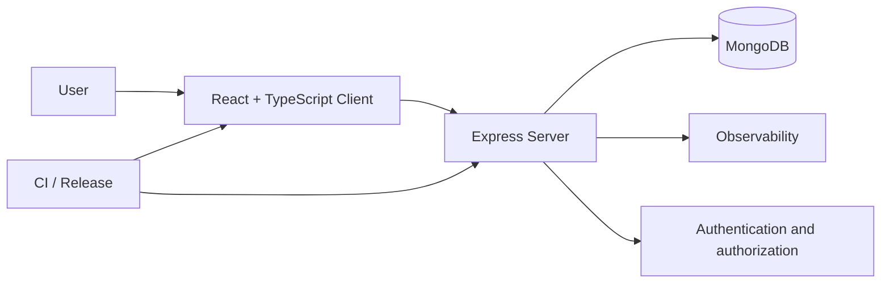
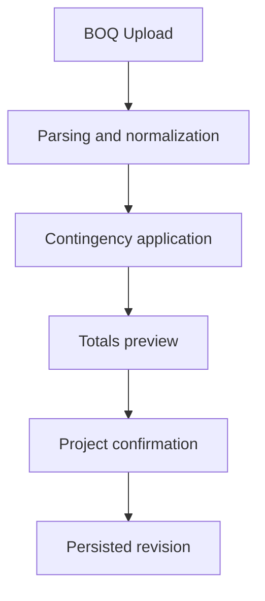

# Technical Architecture

## Overview

The solution follows a full-stack web architecture with clear separation between client, server, and persistence layers.

## Architecture diagrams

## Frontend

- React + TypeScript + Vite.
- Domain-oriented components and modular styles.
- i18n integration and route/component testing.

## Backend

- Node.js + TypeScript + Express.
- Route organization by functional context.
- Middleware for authentication, authorization, rate limiting, and observability.

## Data

- MongoDB with domain models: projects, budgets, audit, attendance, and events.
- Revision-oriented structures for traceability.

## Integrations and operations

- CI workflows, quality checks, and release automation.
- Scripts for seed/reset of demo tenant and smoke checks.
- OpenAPI and contract validations where applicable.

## Relevant technical decisions

- End-to-end TypeScript to reduce functional regressions.
- Domain models for incremental feature evolution.
- Specialized middleware as cross-cutting guardrails.

## Technical evidence in the product

- Client/server separation for loose coupling and parallel evolution.
- Domain-specialized routes and services to reduce accidental complexity.
- Contracts and validations for resilient APIs and integrations.
- Observability and instrumentation for faster incident diagnosis.
- Operational scripts for seed, demo reset, and runtime health checks.
