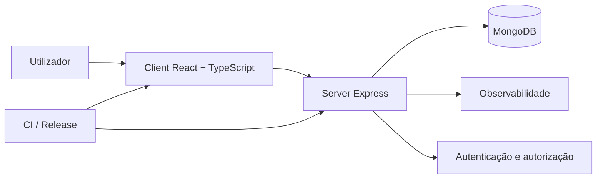
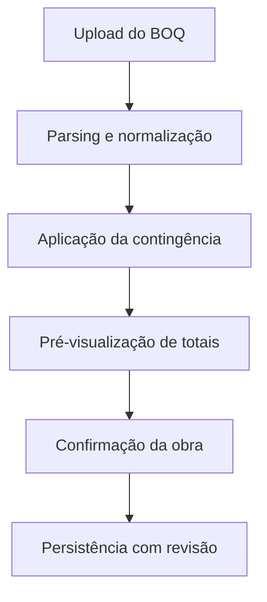

# Arquitetura Técnica

## Panorama

A solução segue arquitetura web full-stack, com separação clara entre client, server e persistência.

## Diagramas de arquitetura

## Frontend

- React + TypeScript + Vite.
- Componentização por domínio e estilos modulares.
- Integração com i18n e testes de rotas/componentes.

## Backend

- Node.js + TypeScript + Express.
- Rotas por contexto funcional.
- Middlewares para autenticação, autorização, rate limit e observabilidade.

## Dados

- MongoDB com modelos por domínio: obras, orçamentos, auditoria, presenças e eventos.
- Estruturas orientadas a histórico/revisão para rastreabilidade.

## Integrações e operação

- Workflows CI, validação de qualidade e automação de releases.
- Scripts para seed, reset de demo tenant e smoke checks.
- OpenAPI e validações de contrato quando aplicável.

## Decisões técnicas relevantes

- TypeScript end-to-end para reduzir regressão funcional.
- Modelos por domínio para evolução incremental de features.
- Middlewares especializados para guardrails transversais.

## Evidências técnicas no produto

- Estrutura client/server separada para desacoplamento e evolução paralela.
- Rotas e serviços especializados por domínio para reduzir complexidade acidental.
- Contratos e validações para robustez de integrações e APIs.
- Observabilidade e instrumentação para diagnóstico rápido de incidentes.
- Scripts operacionais para seed, reset de demo e verificação de saúde da aplicação.
